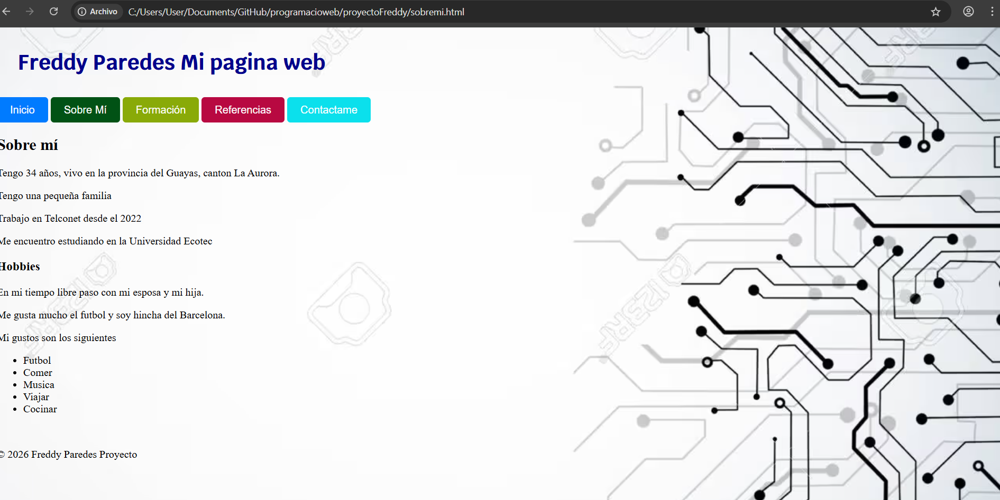
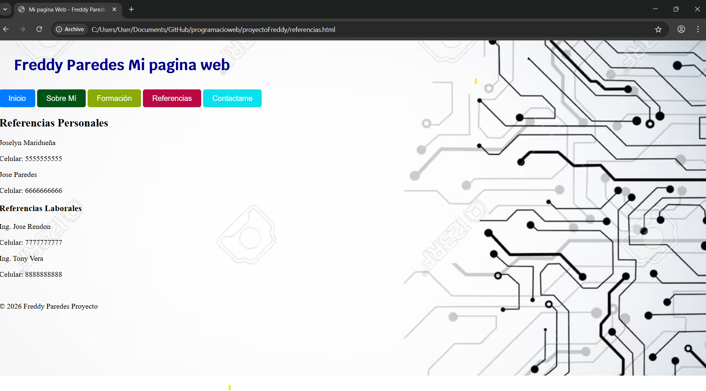
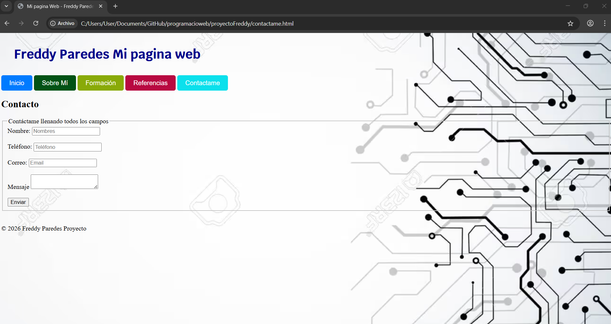
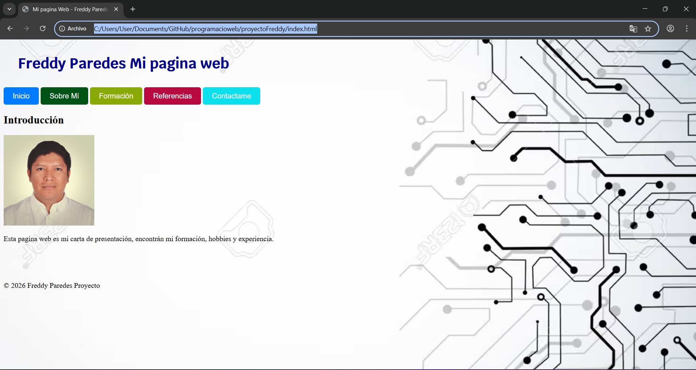

# proyectoFreddy

Pagina web de mi hoja de vida sencilla para proyecto de la clase de programacion web

Esta hecho en html basico con css basico

la estructura es:
index.html
y el mismo tiene menu a los otros html como 
- sobremi.html
- formacion.html
- referencias.html
- contactos.html

las imagenes estan en la carpeta img

el CSS esta en la carpeta css y en la misma se encuentra una imagen usada como fondo en mi pagina web

